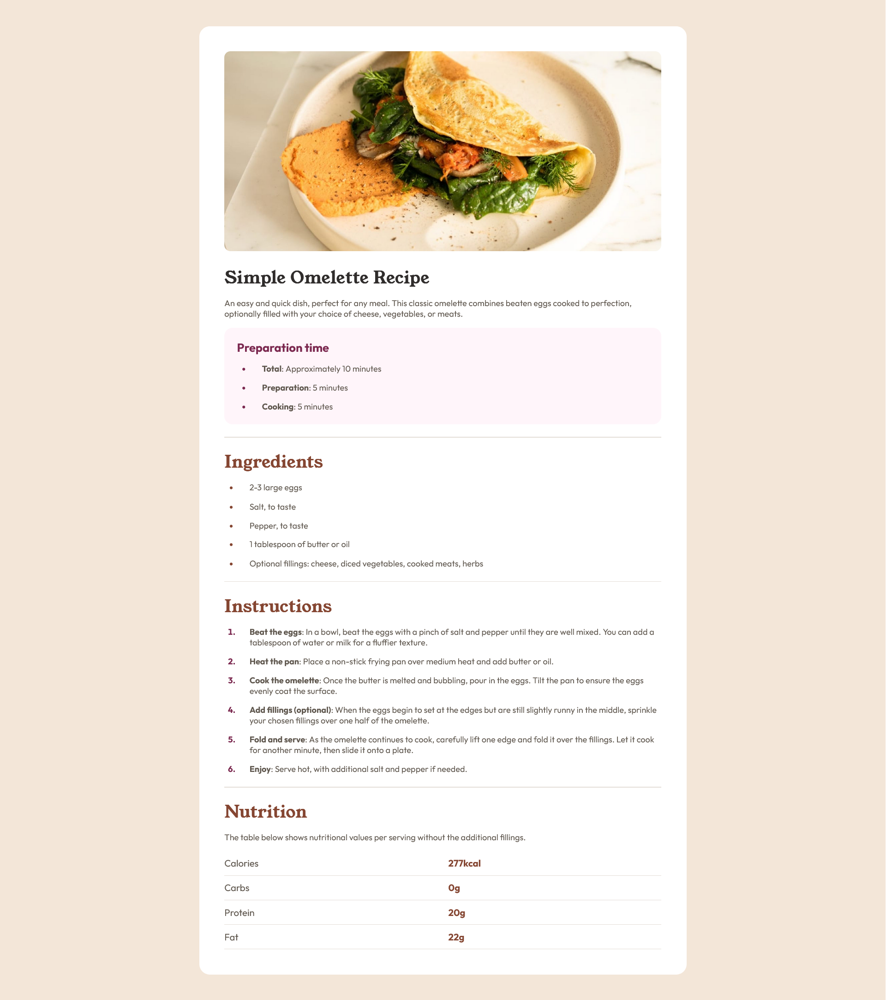

# Frontend Mentor - Recipe page solution

This is a solution to the [Recipe page challenge on Frontend Mentor](https://www.frontendmentor.io/challenges/recipe-page-KiTsR8QQKm). Frontend Mentor challenges help you improve your coding skills by building realistic projects. 

## Overview

### Screenshot

### Links

- Solution URL: [Add solution URL here](https://github.com/siyam-eng/recipe-page)
- Live Site URL: [Add live site URL here](https://siyam-eng.github.io/recipe-page/)

## My process

### Built with

- Semantic HTML5 markup
- CSS custom properties
- Flexbox

### What I learned
I completed this project after a long gap from coding. So, I brushed up some of my CSS skills and I am looking forward to learning more. 

## Author

- Website - [Siyam Ahmed](https://siyamahmed.com)
- Frontend Mentor - [@yourusername](https://www.frontendmentor.io/profile/Siyam1888)
- Twitter - [@yourusername](https://www.twitter.com/siyam_88)
